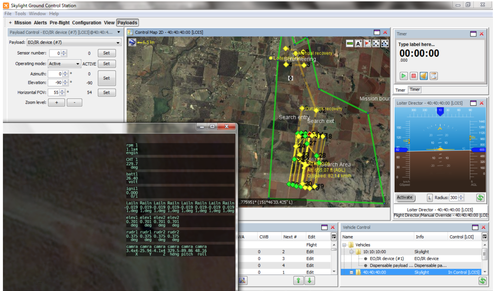
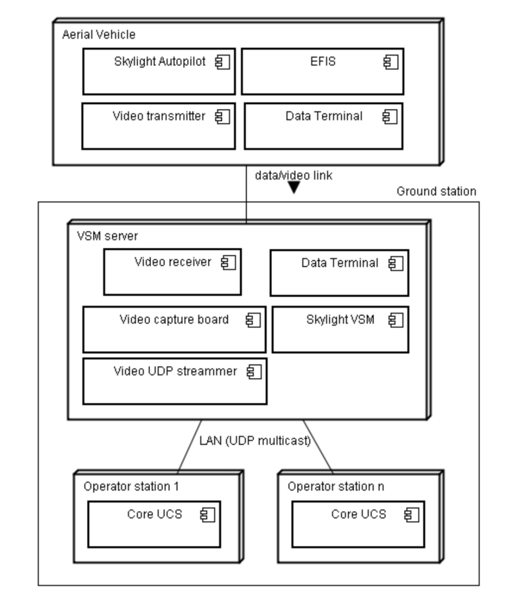
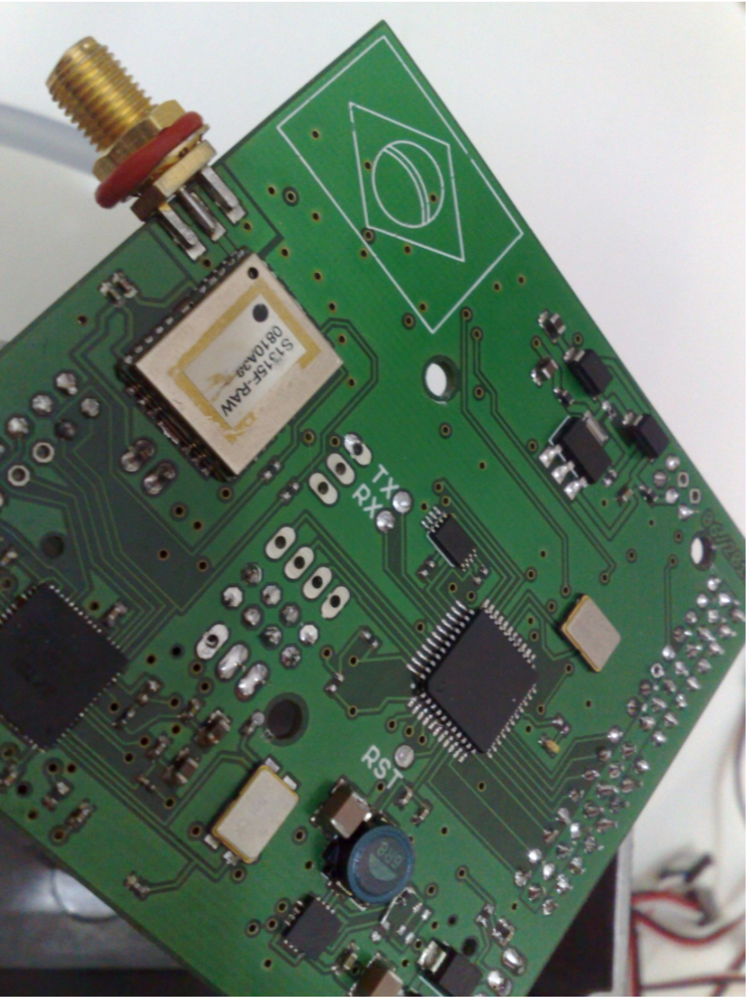
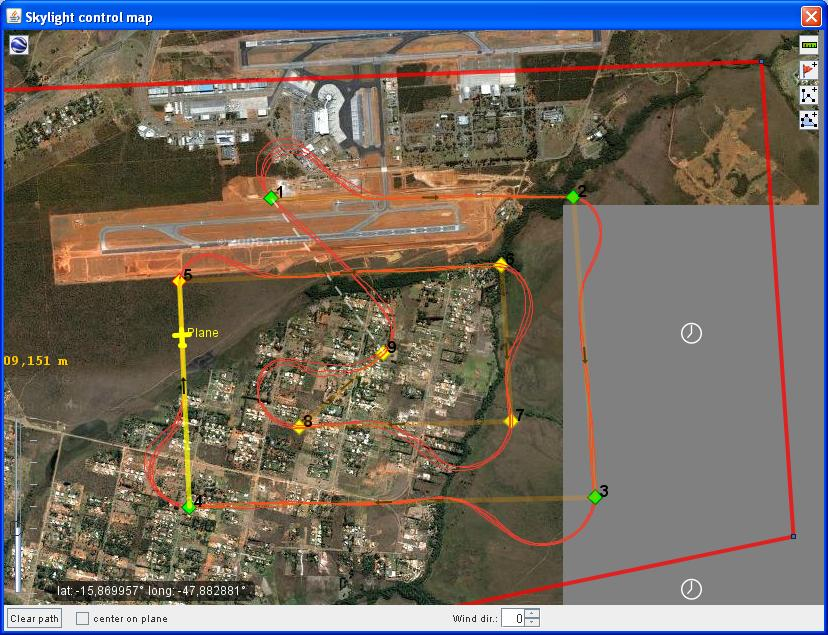
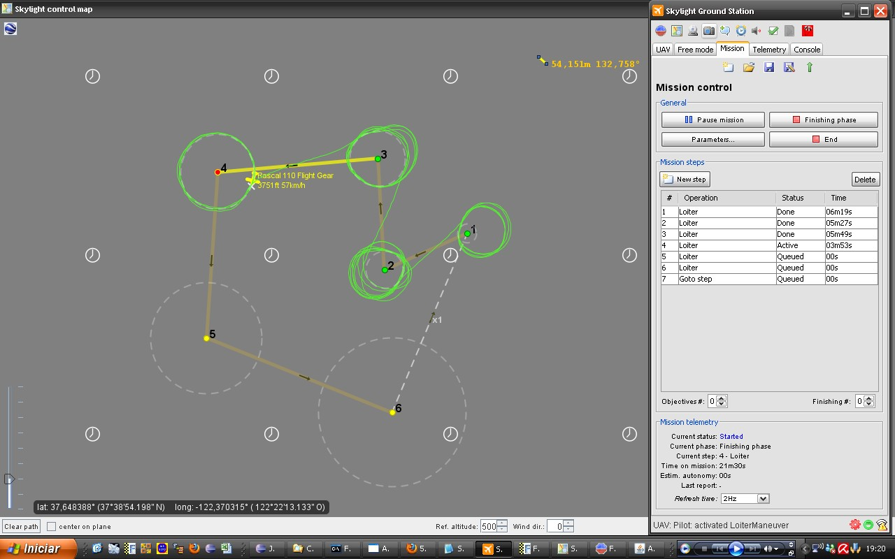

# skylight-uas
This is a complete Unmanned Aerial System composed of an Autopilot, along with a Ground Station, VSM, embedded eletronics for sensors and actuators, low and high level controls, all compatible with OTAN's STANAG 4586. We created this system while competing at the UAV Outback Challenge at Australia. We (me and [Eduardo Steinhorst](https://github.com/edusteinhorst)) designed this between 2008 and 2010.

* [See here our presentation at Outback Challenge 2010](https://github.com/flaviostutz/skylight-uas/blob/master/docs/SkylightTeamPresentation.pdf)

* See some video recordings at
  * [Camera looking at fixed point while vehicle is loitering](https://youtu.be/FlndEQ9n3b8)
  * [Autopilot landing a Cesna while in loop with XPlane](https://youtu.be/2C-lTjXJ4d8)
  * [Autopilot landing a Rascal while in loop with FlightGear](https://youtu.be/yrF2cjR2COY)

## Design

This is the third version of the architecture of the UAS hardware and software.

The first version was based on a self made electronics with sensors and actuators. The Autopilot was a MIDP Java application installed on a N95 smartphone. The communications between N95 and sensor/actuators board was Bluetooth and the N95 to ground was through Wifi. In this version we used a lot of things that were ready, but as customization was needed we began to suffer.

At this point we decided to use a second version of the architecture with an onboard computer and a Java main application. In the middle of the refactoring process we realized some great improvements over energy usage, computer dimensions and software architecture, so we started the refactoring to our third version.

The third architecture version (current) relies on:
* 900MHz modem
* Gumstix computer
* Onboard Autopilot (based on plugins)
* Ground Station (based on plugins)
* [Rascal Model Airplane] (http://www.sigmfg.com/IndexText/SIGRC80.html)
* VSM for Ground Station to Vehicle coordination
* Communications, control and structure compatible with NATO's STANAG 4586 (in theory OTAN could control our Vehicle, and our Ground Station could control OTAN's drones)
* Self made electronics board for sensoring and actuation
* See /docs for more documentation (there are some documents that we sent to UAV Outback Challenge describing our system)

## Capabilities
* Long range operations (10km+)
* Custom payload control
* Assisted control (altitude, heading, airspeed, ground speed)
* Alert control systems
* Point and click mission plan designer
* Realtime telemetry of various system attributes
* Autopilot plugin extensibility
* GroundStation plugin extensibility
* Customizable emergency plans (loiter and wait for comms, goto comms point, goto landing site)
* Autonomous take-off/landing (tested only on realistic simulators but not on the real plane because of lack of DGPS)
* Fully autonomous operation on air (vehicle + payload) through mission plans (can be updated on air)
* Autonomous landing (tested only on simulators because we would need a RTK GPS for this)

* Skylight autopilot landing a Rascal model on FlightGear (click to play video)

* Skylight autopilot landing a Cesna model on XPlane (click to play video)

* Track waypoints test

* Loiter test

## UAV Outback Challenge
We started our project on 2008 and participated on 2010 at Kingaroy - Australia
See more below:
* [Outback Challenge Facebook Group] (https://www.facebook.com/groups/177617904551/)
* [Outback Challenge 2010] (http://www.suasnews.com/outback-challenge-2010/)

## For building

* Start xQuartz in Mac

* Configure xQuartz to accept external connections in "Preferences..." -> Security -> Allow...

* Restart xQuartz

* docker-compose build

* docker-compose up

